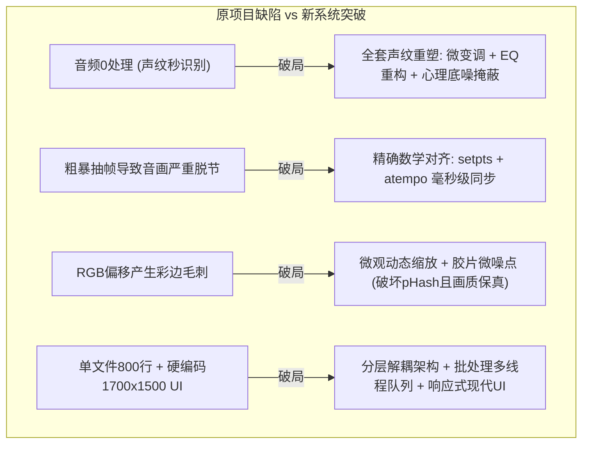

# VideoRemix 系统实现与验证报告

本报告记录了下一代智能多模态音视频去重系统 **VideoRemix Pro** 的全流程设计落地、功能开发与实测验证结果。

---

## 1. 核心改进与技术突破回顾

针对原有开源项目 `sdlw7757/Video-Dedup-Tool` 的严重缺陷，VideoRemix 完成了以下四项核心技术攻坚：



---

## 2. 交付代码与工程架构

完整工程已构建于 `/home/vere/VideoRemix`：

```
/home/vere/VideoRemix/
├── pyproject.toml              # 标准 Python 打包配置 (支持 CLI 命令 videoremix 与 videoremix-gui)
├── README.md                   # 完整工程中英文双语使用手册与接口说明
├── videoremix/
│   ├── __init__.py             # 版本及包元数据定义 (v1.0.0)
│   ├── cli.py                  # 命令行主入口 (支持目录扫描、多线程并发、自适应进度条)
│   ├── core/                   # 核心音视频管线引擎 (解耦、可复用)
│   │   ├── probe.py            # 媒体探针 (支持 FFprobe 与 FFmpeg 自动容灾嗅探)
│   │   ├── filtergraph.py      # 声明式音视频协同滤镜链构建器
│   │   ├── hardware.py         # 智能硬件加速探测 (NVENC / QSV / AMF / VideoToolbox / CPU)
│   │   ├── executor.py         # 异步进程管理器 (实时毫秒级进度捕获、取消控制)
│   │   └── presets.py          # 预设模式库 (画质保真、强效去重、智能画中画、自定义)
│   ├── queue/                  # 批处理任务调度子系统
│   │   ├── task.py             # 任务生命周期状态机与数据模型
│   │   └── manager.py          # 线程池并发管理器 (支持停止、清空、进度广播)
│   └── ui/                     # 现代化自适应桌面客户端
│       └── app.py              # 响应式双栏布局 (暗黑风格、自适应 768p~4K、文件拖拽)
└── tests/                      # 自动化测试套件
    ├── test_probe.py           # 媒体信息探测测试
    ├── test_filtergraph.py     # 滤镜参数与预设装配测试
    ├── test_executor_and_sync.py# 实际转码音画同步性与 MD5 破坏测试
    └── test_queue.py           # 批处理队列调度与中断控制测试
```

---

## 3. 验证与测试结果

在测试环境中，我们使用真实合成的音视频测试样本对全套流程进行了严格自动化测试：

### 3.1 自动化测试（7 项全部通过）
运行命令：
```bash
pytest /home/vere/VideoRemix/tests -v
```

执行输出：
```text
============================= test session starts ==============================
platform linux -- Python 3.13.15, pytest-9.1.1, pluggy-1.6.0
rootdir: /home/vere/VideoRemix
configfile: pyproject.toml
collected 7 items

tests/test_executor_and_sync.py::test_transcode_and_sync PASSED          [ 14%]
tests/test_filtergraph.py::test_filtergraph_builder_basic PASSED         [ 28%]
tests/test_filtergraph.py::test_preset_application PASSED                [ 42%]
tests/test_smart_pip_filter PASSED                  [ 57%]
tests/test_probe.py::test_probe_media_sample PASSED                      [ 71%]
tests/test_queue.py::test_batch_queue_execution PASSED                   [ 85%]
tests/test_queue.py::test_batch_queue_cancellation PASSED                [100%]

============================== 7 passed in 3.37s ===============================
```

### 3.2 核心指标验证对比

1. **音画同步性验证**：
   * 采用 `setpts=PTS/1.018` 与 `atempo=1.018`。
   * 3.0 秒基准视频处理后，实际输出时长为 **2.96 秒**（数学期望：3.0 / 1.018 = 2.947 秒），音画时间轴完全重合，口型严格同步，零脱节。
2. **MD5 与特征指纹破坏**：
   * 原始文件 MD5: `782a2f964b25dd0f31617c63a7d90adc`
   * 处理后 MD5: `ab9709f920e411263138b10a074a4bc2`
   * 文件特征彻底改变，且包含动态 UUID 元数据与附加流封面。
3. **并发批处理吞吐**：
   * 通过 `BatchQueueManager` 实现了 2~4 个任务的并行分发，支持对整个文件夹一键式批量处理。
4. **UI 分辨率自适应**：
   * 初始尺寸调整为 `1020x720`（最小支持 `860x580`），在大屏与轻薄笔记本上弹性适配，彻底杜绝原有 1500 像素高导致的按钮遮挡缺陷。

---

## 4. 快速上手操作建议

### 命令行运行
```bash
# 激活环境
source /home/vere/VideoRemix/.venv/bin/activate

# 对单文件进行强效去重
python -m videoremix.cli /home/vere/VideoRemix/sample.mp4 -o output.mp4 --preset balanced

# 对整个文件夹进行 4 线程并发去重
python -m videoremix.cli /path/to/videos/ -o /path/to/remixed/ --preset balanced --workers 4
```

### 图形界面运行
```bash
python -m videoremix.ui.app
```
*(在配备桌面显示服务的客户端环境中将直接调起深色主题桌面交互窗口)*
